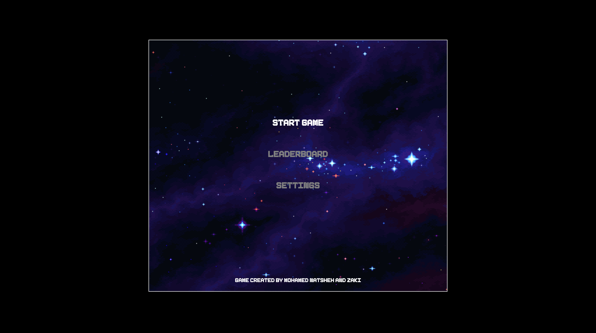
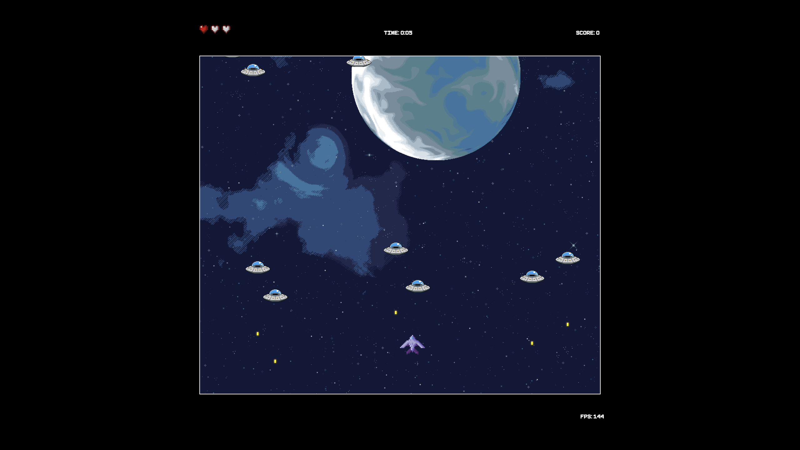

# JS Space Invaders

A retro-style browser game where you control a ship, avoid obstacles, and shoot enemies. Features sound effects, 8-bit style graphics, and a persistent local leaderboard.

## How to Play

1. Open `index.html` in your web browser.
2. Click **Start Game** and enter your name.
3. Use your keyboard to control the ship and shoot.
4. Try to survive as long as possible and get a high score! (for a fun challenge, try to beat the highscore we got while in development which was 349!)
5. When the game ends, you can restart or end and submit your score to the leaderboard.

## Features

- **Sound effects** and retro 8-bit style graphics
- **Local leaderboard** (top 10 scores saved in your browser)
- **Name entry** before each game
- **Pause and resume** with the Escape key
- **Settings page** (visual only, might make it functional later on)
- **Navigation:** Press Escape on any menu or leaderboard page to go back

## Screenshots

### Main Menu

### Gameplay

## File Structure

- `index.html` — Main menu
- `name.html` — Name entry before starting the game
- `game.html` — The main game
- `leaderboard.html` — View the top 10 scores
- `settings.html` — Visual settings page
- `game.js`, `utils.js`, `leaderboard.js`, `chicken.js`, `gun.js`, `sounds.js` — Game logic and helpers
- `audio/`, `images/`, `font/` — Assets

## Credits

- Sound and graphics are free assets from the internet
- Developed by Mohamed Natsheh and Zaki Awadallah

